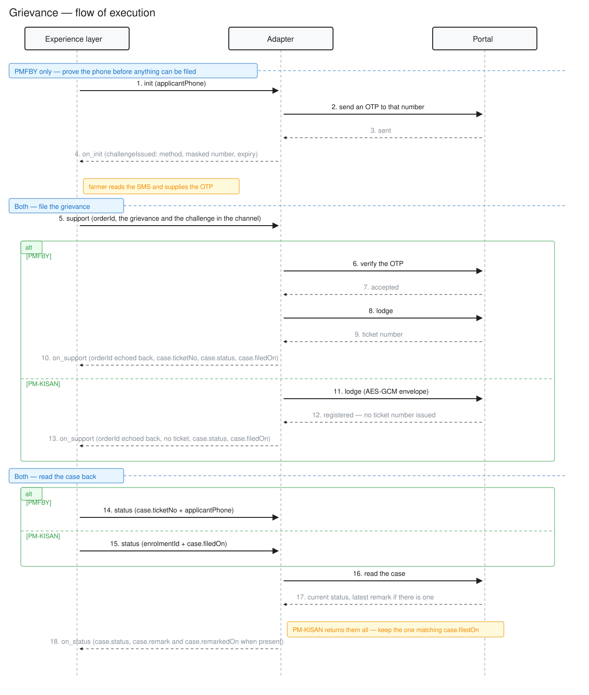

# Grievance — flow of execution

Two providers, one capability. Every call is synchronous: the `on_*` reply comes back on
the same HTTP response, not on a callback.

> What the two portals actually accept and return — one line of provenance per field —
> is `grievance-upstream-contracts.md`. Where this page and that one disagree, that one
> wins.

The grievance is lodged with `/support` and read back with `/status`. PMFBY issues a
challenge first — an SMS OTP — so it has an `/init` call; PM-KISAN does not. Which of
the two a caller is looking at is published in the catalog, not assumed: `/discover`
comes before everything else and says so.

This page is the sequence of execution — the calls in order, and the payloads they carry.

| | PMFBY | PM-KISAN |
|---|---|---|
| Steps | `discover` → `init` → `support` → `status` | `discover` → `support` → `status` |
| Identity proof | `challenge`, method `SMS_OTP`, to the farmer's phone | none — the portal asks for none |
| Farmer is known by | mobile number | registration number |
| Case is retrieved by | ticket number + phone | identity + the date it was filed |
| `@type` | `openagrinet:PMFBYGrievance` | `openagrinet:PMKISANGrievance` |

---

## Contents

1. [Where every field sits](#1-where-every-field-sits)
2. [Call sequence](#2-call-sequence)
3. [Reading `code` and `name`](#3-reading-code-and-name)
4. [Discovery](#4-discovery)
5. [PMFBY](#5-pmfby) — `discover` → `init` → `support` → `status`
6. [PM-KISAN](#6-pm-kisan) — `discover` → `init` → `support` → `status`
7. [Required fields by call](#7-required-fields-by-call)
8. [Rules that apply to both schemes](#8-rules-that-apply-to-both-schemes)
9. [Errors](#9-errors)
10. [Registry](#10-registry)

---

## 1. Where every field sits

**The band a field sits in says who wrote it.**

Everything the grievance is about travels in the attributes, on every call. Learn these five
bands once and every example on this page reads the same way.

| band | holds | written by |
|---|---|---|
| top level | who is asking and about what: `informationMode`, `provider`, `scheme`, `enrolmentId`, and the PMFBY-only `applicantPhone`, `cropYear`, `season` | the caller |
| `grievance` | what the farmer submitted: `category`, `subCategory`, `description` | the farmer |
| `case` | the record the portal holds: `ticketNo`, `status`, `filedOn`, and, by scheme, `cropName` or `remark` + `remarkedOn` | the portal |
| `challenge` | proof of the phone number, on the way in only | the caller |
| `challengeIssued` | the acknowledgement of that proof, on the way out only | the portal |

The `case` band differs by scheme. PMFBY returns `cropName` and never a remark — its pack
refuses `remark` and `remarkedOn`. PM-KISAN returns `remark` and `remarkedOn` and has no
crop. Both return `ticketNo`, `status` and `filedOn`.

The two challenge bands differ by scheme too. PMFBY's OTP is six digits and its
`challengeIssued` names a masked number in `sentTo`. PM-KISAN's is four digits and its
`challengeIssued` has no `sentTo` at all — the portal does not say where it sent the OTP.

Nothing rides in a Beckn `descriptor`. The category, the sub-category and the farmer's
words are attribute fields, so the pack bounds each one.

| | on `support` | on `init` / `status` |
|---|---|---|
| the bands above | `support.channels[0]`, selected by `@type` | `commitmentAttributes` |
| `orderId` | `enrolmentId`, echoed unchanged on the reply | — (`Contract` has no `orderId`) |
| `provider` | in the attributes, because a `SupportAction` has no `Contract` | `commitments[].offer.provider`; the attributes do **not** repeat it |

A band is absent when there is nothing in it. `init` asks for a challenge before the farmer
has stated anything, so it carries no `grievance`; an ask carries no `case`, because only the
portal writes one.

`provider` is the same shape everywhere — `{ "id": …, "descriptor": { "name": … } }`. The
adapter routes on `id`; `name` is display text.

**On `init` and `status` the envelope is a Beckn `Contract` holding one commitment**, and
the payload rides on `commitmentAttributes`. The commitment's one resource stays thin: the
resource id from the catalog, plus the `quantity` the spec requires — send `{"count": 1}`
in both directions. That id is fixed per provider and names the catalog entry, never the case.

**On `support` there is no contract** — a `SupportAction` has no `contract` property. The
payload rides in `support.channels[0]`. On the ask there is exactly one channel and it is
the complaint; the adapter refuses a second. On a reply, address the entry by `@type` rather
than by index — a helpline channel could sit beside the case.

---

## 2. Call sequence



The diagram starts at the lodge. `discover` is not in it — it runs once against the
discovery service rather than per grievance, and it talks to neither portal. Each
scheme's Step 0 below covers it.

Both schemes open with `init` to request an OTP, and the OTP never reaches the call it
authorises, is never logged and is never returned.

Neither portal's ticket is the `orderId`: it arrives separately, in `case.ticketNo` on the
channel. Both portals issue one on a lodge. Two things differ on the read:

- **How the case is found.** PMFBY takes the ticket number back. PM-KISAN has no
  per-grievance endpoint, so its case is found by identity and the date it was filed.
- **Whether the read is challenged.** PMFBY's is not — the ticket number is held only by
  whoever filed. PM-KISAN's is — a registration number alone would return every grievance
  on it, so the read asks for a fresh OTP of its own.

---

## 3. Reading `code` and `name`

Four fields below are a `code` + `name` pair: `scheme`, `grievance.category`,
`grievance.subCategory` and `case.status`. They all follow one rule.

- **`code` is the network's word.** It comes from a list this network governs.
  Branch on it.
- **`name` is the portal's own phrase, carried through untouched.** Show it. It
  is what the farmer would read on the portal's own screen, so it may well say
  `"Open"` where the code says `UnderReview`.
- **A missing `name` means the portal said nothing**, and the adapter derived the
  code rather than quoting a phrase. That is information, not an omission.

One field looks exactly like these and is not: a commitment's `status.descriptor`.
It sits in the same payload as `case.status`.

It answers a different question. `case.status` says how the grievance is going.
`status.descriptor.code` is Beckn's own contract lifecycle — `DRAFT` while a
challenge is outstanding, `ACTIVE` from the moment the grievance is lodged — and
nothing the portal reports ever moves it.

So: `case.status` to tell the farmer anything; `status.descriptor` never.

---

## 4. Discovery

The adapter publishes one catalog per scheme, once. A caller sends one `discover` and
reads the ids every later call quotes out of the reply. Both requests are shown in each
scheme's Step 0 below.

| from the `on_discover` reply | what it is for |
|---|---|
| `provider.id` | becomes `offer.provider.id`, and `channels[].provider.id` on `support` |
| `offers[].id`, `resources[].id` | quoted verbatim in every commitment |
| `resourceAttributes.@context` | the pack URL. Swap `context.jsonld` for `attributes.yaml` and it states every field, bound and value space the later payloads are held to |
| `resourceAttributes.challengeMethods` | whether this desk challenges the caller |

`on_discover` returns the matching catalogs whole, `resourceAttributes` included, on the
same HTTP response — synchronous, like every other call on this page.

Filters are JSONPath, and only `resourceAttributes` is reachable from an expression:

```
"$.catalogs[*].resources[*] ? (@.resourceAttributes.scheme.code == \"PM-KISAN\")"
"$.catalogs[*].resources[*] ? (@.resourceAttributes.challengeMethods[*] == \"SMS_OTP\")"
```

The first matches a known scheme; the second matches every desk that will send an OTP.

### 4.1 Choosing the sequence: `challengeMethods`

Every catalog entry carries it, and it settles the sequence before a caller sends
anything.

- **Non-empty** — `init` first, and the array names the challenge. Both schemes publish
  `["SMS_OTP"]` today.
- **Empty** — no challenge, and `support` is the first call. No scheme publishes this today.

Branch on the values, not on the length: a portal that adds a second mechanism widens
the list, and a caller that reads the method keeps working.

It does not say *which* calls are challenged — PMFBY challenges the lodge alone, PM-KISAN
the lodge and the read. That, and everything else a particular call must carry, is in
[Required fields by call](#7-required-fields-by-call).

---

## 5. PMFBY

### 5.1 Step 0 — publish and discover

#### Published by the adapter — `catalog/publish`

The adapter publishes this once. A caller never sends it.

```json
POST /catalog/publish
{
  "context": {
    "domain": "agriculture",
    "action": "catalog/publish",
    "version": "2.0.0",
    "senderId": "grievance.adapter.openagrinet.org",
    "receiverId": "discovery.openagrinet",
    "transactionId": "7c2e1a94-3b6d-4f82-a1c5-9d0e4b7f2a61",
    "messageId": "d4f81b03-9e27-4a5c-8b16-3c7a0f5e9d82",
    "timestamp": "2026-10-06T06:30:00Z",
    "schemaContext": [
      "https://openagrinet.github.io/network-specs/api-schemas/PMFBYGrievance/v0.1/context.jsonld#openagrinet:PMFBYGrievance"
    ]
  },
  "message": {
    "catalogs": [{
      "id": "cat-pmfby-grievance",
      "isActive": true,
      "descriptor": {
        "code": "PMFBY-GRIEVANCE",
        "name": "PMFBY Grievance Desk",
        "shortDesc": "File and track crop-insurance grievances",
        "longDesc": "Lodge a grievance against a PMFBY enrolment and read the case back. Filing is protected by an SMS OTP sent to the enrolled mobile number."
      },
      "provider": {
        "id": "pmfby",
        "descriptor": { "code": "PMFBY", "name": "PMFBY Grievance Portal" }
      },
      "resources": [{
        "id": "res:pmfby:grievance",
        "descriptor": { "code": "PMFBY-GRV", "name": "PMFBY grievance filing and status" },
        "resourceAttributes": {
          "@context": "https://openagrinet.github.io/network-specs/api-schemas/PMFBYGrievance/v0.1/context.jsonld",
          "@type": "openagrinet:PMFBYGrievance",
          "informationMode": "OnDemand",
          "scheme": { "code": "PMFBY", "name": "Pradhan Mantri Fasal Bima Yojana" },
          "challengeMethods": ["SMS_OTP"]
        }
      }],
      "offers": [{
        "id": "off:pmfby:grievance",
        "resourceIds": ["res:pmfby:grievance"]
      }]
    }],
    "publishDirectives": [
      { "catalogId": "cat-pmfby-grievance", "catalogType": "REGULAR" }
    ]
  }
}
```

- `@type` and `@context` are the ones every PMFBY payload below carries: a capability
  declaration is the pack in `OnDemand` mode.
- `challengeMethods: ["SMS_OTP"]` is what tells a caller to run `init` first.
- `provider` carries no `availableAt`: a grievance desk has no premises.
- `visibleTo` is omitted, so every caller can find it.

#### Sent by the caller — `discover`

```json
POST /discover
{
  "context": {
    "domain": "agriculture", "action": "discover", "version": "2.0.0",
    "transactionId": "0f3b7d21-8c45-4e96-b2a7-5d1c8e0f4a93",
    "messageId": "6a9e2c58-1d74-4b03-8f5a-7c2b9e6d0a14",
    "timestamp": "2026-10-06T09:12:00Z"
  },
  "message": {
    "intent": {
      "textSearch": "grievance",
      "filters": {
        "type": "jsonpath",
        "expression": "$.catalogs[*].resources[*] ? (@.resourceAttributes.scheme.code == \"PMFBY\")"
      }
    }
  }
}
```

`on_discover` returns the catalog above. Take `provider.id`, `offers[].id` and
`resources[].id` from it — Steps 1 to 3 quote them verbatim.

### 5.2 Step 1 — `init`: request a challenge

#### Request

- Carries the farmer's phone in `applicantPhone`, and nothing else.
- No `grievance` band: the farmer has not stated a complaint yet.
- Commitment status is `DRAFT`. The caller mints `contract.id` here and reuses it on `status`.

```json
POST /init
{
  "context": {
    "version": "2.0.0", "action": "init", "networkId": "openagrinet",
    "transactionId": "3f9a…", "messageId": "8c21…",
    "timestamp": "2026-09-28T10:15:00Z"
  },
  "message": { "contract": {
    "id": "b1d4e2f0-5a63-4c81-9e77-2af0c9d31b45",
    "commitments": [{
      "status": { "descriptor": { "code": "DRAFT" } },
      "offer": {
        "id": "off:pmfby:grievance",
        "provider": { "id": "pmfby", "descriptor": { "name": "PMFBY Grievance Portal" } },
        "resourceIds": ["res:pmfby:grievance"]
      },
      "resources": [{ "id": "res:pmfby:grievance", "quantity": { "count": 1 } }],
      "commitmentAttributes": {
        "@context": "https://openagrinet.github.io/network-specs/api-schemas/PMFBYGrievance/v0.1/context.jsonld",
        "@type": "openagrinet:PMFBYGrievance",
        "informationMode": "OnDemand",
        "scheme": { "code": "PMFBY", "name": "Pradhan Mantri Fasal Bima Yojana" },
        "applicantPhone": "9876543210"
      }
    }]
  }}
}
```

#### Response — `on_init`

- Commitment stays `DRAFT`.
- The OTP is never returned. `challengeIssued` gives the mechanism and a masked destination.
- `method`, `sentTo` and `expiresAt` are all required on PMFBY, so all three can be relied on.
- Branch on `method`; do not hard-code "six digits". The enum holds `SMS_OTP` today, and a
  portal that adds a mechanism answers with that method instead.
- `informationMode` is still `OnDemand`, even on a reply. `Direct` means a real case, and
  wherever `Direct` appears the PMFBY pack requires a `case` band carrying `ticketNo`,
  `status` and `filedOn` — an acknowledgement has none of them. (PM-KISAN's pack requires
  `status` and `filedOn` only; see its own section.)

```json
"commitmentAttributes": {
  "@context": "…/api-schemas/PMFBYGrievance/v0.1/context.jsonld",
  "@type": "openagrinet:PMFBYGrievance",
  "informationMode": "OnDemand",
  "scheme": { "code": "PMFBY", "name": "Pradhan Mantri Fasal Bima Yojana" },
  "challengeIssued": {
    "method": "SMS_OTP", "sentTo": "98XXXXXX10", "expiresAt": "2026-09-28T10:25:02Z"
  }
}
```

**Next** — collect the OTP from the farmer, then `support`.

### 5.3 Step 2 — `support`: lodge the grievance

#### Request

- Same `transactionId`, new `messageId`. No contract travels; a `SupportAction` composes none.
- `orderId` is `enrolmentId` — the enrolment the complaint is against.
- The `grievance` band is the whole complaint. `category.code` and `subCategory.code` are
  two separate fields, never one joined string such as `3.10`.
- `channels[0]` carries the `provider` to route to, what identifies the farmer, and the OTP
  in `challenge`.
- Exactly one channel on the request. A second is rejected.

```json
POST /support
{
  "context": {
    "version": "2.0.0", "action": "support", "networkId": "openagrinet",
    "transactionId": "3f9a…", "messageId": "9d44…",
    "timestamp": "2026-09-28T10:18:30Z"
  },
  "message": {
    "support": {
      "orderId": "KA2026KH00123456",
      "channels": [{
        "@context": "…/api-schemas/PMFBYGrievance/v0.1/context.jsonld",
        "@type": "openagrinet:PMFBYGrievance",
        "informationMode": "OnDemand",
        "provider": {
          "id": "pmfby",
          "descriptor": { "name": "PMFBY Grievance Portal" }
        },
        "scheme": { "code": "PMFBY", "name": "Pradhan Mantri Fasal Bima Yojana" },
        "applicantPhone": "9876543210",
        "cropYear": "2026",
        "season": "Kharif",
        "complaintDate": "2026-09-28",
        "receiptSourceId": "134306",
        "grievance": {
          "category": { "code": "3", "name": "Enrollment / Portal Issues" },
          "subCategory": { "code": "10", "name": "Login" },
          "description": "Cannot log in to the PMFBY portal to view my Kharif 2026 enrolment."
        },
        "challenge": { "method": "SMS_OTP", "value": "482137" }
      }]
    }
  }
}
```

#### Response — `on_support`

- `orderId` is echoed unchanged.
- `case.ticketNo` is the ticket the portal just issued.
- `informationMode` flips to `Direct`.
- `case.status`, `case.filedOn` and `provider` are the adapter's assertions, not the
  portal's; the `grievance` band is the caller's own words echoed back.
- `challenge` and `applicantPhone` are dropped by the response allow-list.

```json
{
  "context": { "action": "on_support", "messageId": "9d44…", "…": "…" },
  "message": {
    "support": {
      "orderId": "KA2026KH00123456",
      "channels": [{
        "@context": "…/api-schemas/PMFBYGrievance/v0.1/context.jsonld",
        "@type": "openagrinet:PMFBYGrievance",
        "informationMode": "Direct",
        "provider": {
          "id": "pmfby",
          "descriptor": { "name": "PMFBY Grievance Portal" }
        },
        "scheme": { "code": "PMFBY", "name": "Pradhan Mantri Fasal Bima Yojana" },
        "grievance": {
          "category": { "code": "3", "name": "Enrollment / Portal Issues" },
          "subCategory": { "code": "10", "name": "Login" },
          "description": "Cannot log in to the PMFBY portal to view my Kharif 2026 enrolment."
        },
        "case": {
          "ticketNo": "100626000099001",
          "status": { "code": "Registered" },
          "filedOn": "2026-09-28"
        }
      }]
    }
  }
}
```

No helpline channel is emitted — neither scheme publishes one. One added later becomes a
second member of `channels`, so select the case record by `@type`, never by position.

**Next** — store `contract.id`, `case.ticketNo` and the phone number. `status` needs all three.

### 5.4 Step 3 — `status`: check the ticket

#### Request

- New `transactionId` — a separate session, days later. Same `contract.id` as `init`.
- No `grievance` band: this names a ticket, it does not restate the complaint.
- Sends `case.ticketNo` and `applicantPhone`.
- No `challenge`. The OTP is used once, at filing.

> **The read is not authenticated.** Anyone holding both the ticket number and the filing
> phone number can read the case. It is not enumerable, since a ticket is not guessable from
> a phone, but nothing proves the caller is the farmer.

```json
POST /status
{
  "context": {
    "version": "2.0.0", "action": "status", "networkId": "openagrinet",
    "transactionId": "b7e0…", "messageId": "2f8c…",
    "timestamp": "2026-10-02T09:02:11Z"
  },
  "message": { "contract": {
    "id": "b1d4e2f0-5a63-4c81-9e77-2af0c9d31b45",
    "commitments": [{
      "status": { "descriptor": { "code": "ACTIVE" } },
      "offer": {
        "id": "off:pmfby:grievance",
        "provider": { "id": "pmfby", "descriptor": { "name": "PMFBY Grievance Portal" } },
        "resourceIds": ["res:pmfby:grievance"]
      },
      "resources": [{ "id": "res:pmfby:grievance", "quantity": { "count": 1 } }],
      "commitmentAttributes": {
        "@context": "…/api-schemas/PMFBYGrievance/v0.1/context.jsonld",
        "@type": "openagrinet:PMFBYGrievance",
        "informationMode": "OnDemand",
        "scheme": { "code": "PMFBY", "name": "Pradhan Mantri Fasal Bima Yojana" },
        "applicantPhone": "9876543210",
        "case": { "ticketNo": "100626000099001" }
      }
    }]
  }}
}
```

#### Response — `on_status`

- The `grievance` band carries the complaint as the portal holds it, and the `case` band the
  record it keeps against it.
- `case.status.code` is the network's word; `case.status.name` is the portal's phrase, when
  it gives one.
- There is no remark. PMFBY returns a status phrase and no reply text, so the pack refuses
  both `case.remark` and `case.remarkedOn`.
- `case.cropName` is the insured crop, which PMFBY returns and no other scheme has.
- The category comes back as a **name with no code** — the portal returns
  `TicketCategoryName` and no id — so `code` is absent here.
- `cropYear` and `season` are absent: the caller sends them, the portal does not return them.
- The portal also returns the farmer's name, state, district and the insurer, plus an
  internal ticket key. All dropped — the response mapping is an allow-list, not a
  passthrough.

```json
{
  "context": { "action": "on_status", "messageId": "2f8c…", "…": "…" },
  "message": { "contract": {
    "id": "b1d4e2f0-5a63-4c81-9e77-2af0c9d31b45",
    "commitments": [{
      "status": { "descriptor": { "code": "ACTIVE" } },
      "offer": {
        "id": "off:pmfby:grievance",
        "provider": { "id": "pmfby", "descriptor": { "name": "PMFBY Grievance Portal" } },
        "resourceIds": ["res:pmfby:grievance"]
      },
      "resources": [{ "id": "res:pmfby:grievance", "quantity": { "count": 1 } }],
      "commitmentAttributes": {
        "@context": "…/api-schemas/PMFBYGrievance/v0.1/context.jsonld",
        "@type": "openagrinet:PMFBYGrievance",
        "informationMode": "Direct",
        "scheme": { "code": "PMFBY", "name": "Pradhan Mantri Fasal Bima Yojana" },
        "enrolmentId": "KA2026KH00123456",
        "grievance": {
          "category": { "name": "Enrollment / Portal Issues" },
          "subCategory": { "name": "Login" },
          "description": "Cannot log in to the PMFBY portal to view my Kharif 2026 enrolment."
        },
        "case": {
          "ticketNo": "100626000099001",
          "status": { "code": "UnderReview", "name": "Open" },
          "filedOn": "2026-09-28",
          "cropName": "Paddy"
        }
      }
    }]
  }}
}
```

**Next** — repeat `status` on demand.

---

## 6. PM-KISAN

- **An OTP guards both legs.** `init` requests one and the portal texts the mobile number it
  already holds against the registration. Filing is challenged, and so is reading back — a
  registration number on its own would return every grievance filed on it. A read that comes
  later needs an `init` of its own.
- **No phone number crosses the network.** The caller never sends one, and the
  acknowledgement names none — not even masked. PM-KISAN does not disclose where it sent
  the OTP.
- **`orderId` is the registration number.** The upstream takes exactly one reference,
  `IdentityNo`. It travels as `enrolmentId` — the same field PMFBY fills with its
  application number — and is echoed unchanged on the reply. `no-log` and `no-trace`.
- **Encryption is handled by the adapter.** PM-KISAN exchanges encrypted envelopes with
  its portal. Callers send and receive the plain Beckn payloads shown below and see none
  of it.

### 6.1 Step 0 — publish and discover

#### Published by the adapter — `catalog/publish`

The adapter publishes this once. A caller never sends it.

```json
POST /catalog/publish
{
  "context": {
    "domain": "agriculture",
    "action": "catalog/publish",
    "version": "2.0.0",
    "senderId": "grievance.adapter.openagrinet.org",
    "receiverId": "discovery.openagrinet",
    "transactionId": "b15f0d83-2a47-4c91-85e6-3f7d2c9a0b64",
    "messageId": "4e8c17a6-9b30-42fd-a157-6d02b8e3c975",
    "timestamp": "2026-10-06T06:31:00Z",
    "schemaContext": [
      "https://openagrinet.github.io/network-specs/api-schemas/PMKISANGrievance/v0.1/context.jsonld#openagrinet:PMKISANGrievance"
    ]
  },
  "message": {
    "catalogs": [{
      "id": "cat-pmkisan-grievance",
      "isActive": true,
      "descriptor": {
        "code": "PMKISAN-GRIEVANCE",
        "name": "PM-KISAN Grievance Desk",
        "shortDesc": "File and track PM-KISAN grievances",
        "longDesc": "Lodge a grievance against a PM-KISAN registration and read the case back. An OTP is required to file and to read."
      },
      "provider": {
        "id": "pmkisan",
        "descriptor": { "code": "PMKISAN", "name": "PM-KISAN Grievance Portal" }
      },
      "resources": [{
        "id": "res:pmkisan:grievance",
        "descriptor": { "code": "PMKISAN-GRV", "name": "PM-KISAN grievance filing and status" },
        "resourceAttributes": {
          "@context": "https://openagrinet.github.io/network-specs/api-schemas/PMKISANGrievance/v0.1/context.jsonld",
          "@type": "openagrinet:PMKISANGrievance",
          "informationMode": "OnDemand",
          "scheme": { "code": "PM-KISAN", "name": "Pradhan Mantri Kisan Samman Nidhi" },
          "challengeMethods": ["SMS_OTP"]
        }
      }],
      "offers": [{
        "id": "off:pmkisan:grievance",
        "resourceIds": ["res:pmkisan:grievance"]
      }]
    }],
    "publishDirectives": [
      { "catalogId": "cat-pmkisan-grievance", "catalogType": "REGULAR" }
    ]
  }
}
```

- Identical in shape to PMFBY's. What differs is the ids, the pack it points at, and
  `challengeMethods`.
- `challengeMethods: ["SMS_OTP"]` tells a caller to open with `init`. What it does not say
  is that PM-KISAN challenges the read as well as the lodge; §7.2 does.

#### Sent by the caller — `discover`

```json
POST /discover
{
  "context": {
    "domain": "agriculture", "action": "discover", "version": "2.0.0",
    "transactionId": "9d4a6f12-7e58-4b03-a2c6-1f8b3e5d7c40",
    "messageId": "2c7e9b40-5a13-46d8-91f2-8e0d4a6c3b57",
    "timestamp": "2026-10-06T09:14:00Z"
  },
  "message": {
    "intent": {
      "textSearch": "grievance",
      "filters": {
        "type": "jsonpath",
        "expression": "$.catalogs[*].resources[*] ? (@.resourceAttributes.scheme.code == \"PM-KISAN\")"
      }
    }
  }
}
```

`on_discover` returns the catalog above. Take `provider.id`, `offers[].id` and
`resources[].id` from it — Steps 1 and 2 quote them verbatim.

### 6.2 Step 1 — `init`: request a challenge

#### Request

- Carries the registration number in `enrolmentId`, and nothing else.
- No phone number: the portal texts the mobile it already holds against that registration.
- No `grievance` band — the farmer has not stated a complaint yet.
- Commitment status is `DRAFT`. The caller mints `contract.id` here. The lodge that
  follows has no contract to carry it into, so this one ends with the `init`; the read
  later on opens its own.

```json
POST /init
{
  "context": {
    "version": "2.0.0", "action": "init", "networkId": "openagrinet",
    "transactionId": "7f3a…", "messageId": "1b85…",
    "timestamp": "2026-09-28T10:58:00Z"
  },
  "message": { "contract": {
    "id": "5e2704c8-9d31-4f6a-b8c0-1a73e6d2f094",
    "commitments": [{
      "status": { "descriptor": { "code": "DRAFT" } },
      "offer": {
        "id": "off:pmkisan:grievance",
        "provider": { "id": "pmkisan", "descriptor": { "name": "PM-KISAN Grievance Portal" } },
        "resourceIds": ["res:pmkisan:grievance"]
      },
      "resources": [{ "id": "res:pmkisan:grievance", "quantity": { "count": 1 } }],
      "commitmentAttributes": {
        "@context": "https://openagrinet.github.io/network-specs/api-schemas/PMKISANGrievance/v0.1/context.jsonld",
        "@type": "openagrinet:PMKISANGrievance",
        "informationMode": "OnDemand",
        "scheme": { "code": "PM-KISAN", "name": "Pradhan Mantri Kisan Samman Nidhi" },
        "enrolmentId": "UP12345678A"
      }
    }]
  }}
}
```

#### Response — `on_init`

- Commitment stays `DRAFT`. The OTP is never returned.
- `challengeIssued` carries `method` and `expiresAt` only. **There is no `sentTo`** — PM-KISAN
  does not disclose the number it texted, and the pack refuses the field rather than invent a
  mask the farmer could not recognise. PMFBY's does carry one; do not write one reader for both.
- Branch on `method`; do not hard-code "four digits".
- `informationMode` stays `OnDemand` — an acknowledgement is not a case.

```json
"commitmentAttributes": {
  "@context": "…/api-schemas/PMKISANGrievance/v0.1/context.jsonld",
  "@type": "openagrinet:PMKISANGrievance",
  "informationMode": "OnDemand",
  "scheme": { "code": "PM-KISAN", "name": "Pradhan Mantri Kisan Samman Nidhi" },
  "challengeIssued": {
    "method": "SMS_OTP", "expiresAt": "2026-09-28T11:08:00Z"
  }
}
```

**Next** — collect the OTP from the farmer, then `support`.

### 6.3 Step 2 — `support`: lodge the grievance

#### Request

- `orderId` is the farmer's PM-KISAN registration number — the same one that went up on `init`.
- `grievance.category.code` is one of the pack's ten codes.
- `challenge.value` is the four-digit OTP from `on_init`. It never reaches the portal's
  lodge call and is never echoed back.
- `channels[0]` carries the `provider` to route to, the scheme, the `grievance` band and the
  `challenge`. There is no phone number and no contract — `support` composes neither.

```json
POST /support
{
  "context": {
    "version": "2.0.0", "action": "support", "networkId": "openagrinet",
    "transactionId": "7f3a…", "messageId": "4a1e…",
    "timestamp": "2026-09-28T11:04:00Z"
  },
  "message": {
    "support": {
      "orderId": "UP12345678A",
      "channels": [{
        "@context": "https://openagrinet.github.io/network-specs/api-schemas/PMKISANGrievance/v0.1/context.jsonld",
        "@type": "openagrinet:PMKISANGrievance",
        "informationMode": "OnDemand",
        "provider": {
          "id": "pmkisan",
          "descriptor": { "name": "PM-KISAN Grievance Portal" }
        },
        "scheme": { "code": "PM-KISAN", "name": "Pradhan Mantri Kisan Samman Nidhi" },
        "grievance": {
          "category": { "code": "G003", "name": "Installment not received" },
          "description": "Third instalment for 2026 has not been credited."
        },
        "challenge": { "method": "SMS_OTP", "value": "4821" }
      }]
    }
  }
}
```

`grievance.category.code` is a closed list, `G001`–`G010`, and the pack holds it as an enum.
There is no `subCategory`: PM-KISAN classifies one level deep, and the pack refuses the
field outright.

```
G001 account number not correct        G006 gender not correct
G002 online application pending        G007 payment related
G003 installment not received          G008 problem in OTP-based eKYC
G004 transaction failed                G009 problem in biometric eKYC
G005 problem in Aadhaar correction     G010 problem in facial eKYC
```

#### Response — `on_support`

- `orderId` is echoed as it went up, exactly as on PMFBY.
- `case.ticketNo` is the portal's — the lodge reply carries `GrievanceID`, or `GrievanceNo`
  where that is absent. The portal uses both names for the same handle; whichever arrives
  lands here.
- The success sentinel arrives under `Status`, `Responce` or `Rsponce`; `"False"` is a
  refusal and becomes a NACK. The prose arrives under `Message`, `message` or `Remark`, and
  is logged redacted, never returned.
- The portal sends no date and no status on a lodge, so `case.status` and `case.filedOn`
  are the adapter's assertions, and the `grievance` band is the caller's own words echoed
  back.

```json
{
  "context": { "action": "on_support", "messageId": "4a1e…", "…": "…" },
  "message": {
    "support": {
      "orderId": "UP12345678A",
      "channels": [{
        "@context": "…/api-schemas/PMKISANGrievance/v0.1/context.jsonld",
        "@type": "openagrinet:PMKISANGrievance",
        "informationMode": "Direct",
        "provider": {
          "id": "pmkisan",
          "descriptor": { "name": "PM-KISAN Grievance Portal" }
        },
        "scheme": { "code": "PM-KISAN", "name": "Pradhan Mantri Kisan Samman Nidhi" },
        "grievance": {
          "category": { "code": "G003", "name": "Installment not received" },
          "description": "Third instalment for 2026 has not been credited."
        },
        "case": {
          "ticketNo": "PMK2026091234",
          "status": { "code": "Registered" },
          "filedOn": "2026-09-28"
        }
      }]
    }
  }
}
```

**Next** — keep the registration number and `case.filedOn`; the read is matched on those
two. Keep `case.ticketNo` as well, to show the farmer. `support` composes no contract of
its own, so there is nothing else to carry forward.

### 6.4 Step 3 — `status`: read the replies

#### Request

- **The read is challenged.** Call `init` again for a fresh OTP, then send it here. The one
  used to file is spent, and it has expired long before the portal replies.
- `contract.id` is the one minted by the `init` immediately before *this* call. It is a
  new value, not the one from the `init` that preceded the lodge four days earlier.
- The registration number rides in `commitmentAttributes.enrolmentId` rather than
  `orderId`, because a `Contract` has no `orderId`.
- `case.filedOn` is the one from `on_support`, and it is required: the portal has no
  per-grievance endpoint, so the date is what picks this grievance out of the farmer's list.

> **Two grievances filed on the same identity on the same day are indistinguishable.** The
> portal issues nothing that would tell them apart.

```json
POST /status
{
  "context": {
    "version": "2.0.0", "action": "status", "networkId": "openagrinet",
    "transactionId": "c04b…", "messageId": "e91f…",
    "timestamp": "2026-10-02T09:10:44Z"
  },
  "message": { "contract": {
    "id": "c9b31a45-0f78-4e2d-9a60-84b7d3e15c02",
    "commitments": [{
      "status": { "descriptor": { "code": "ACTIVE" } },
      "offer": {
        "id": "off:pmkisan:grievance",
        "provider": { "id": "pmkisan", "descriptor": { "name": "PM-KISAN Grievance Portal" } },
        "resourceIds": ["res:pmkisan:grievance"]
      },
      "resources": [{ "id": "res:pmkisan:grievance", "quantity": { "count": 1 } }],
      "commitmentAttributes": {
        "@context": "…/api-schemas/PMKISANGrievance/v0.1/context.jsonld",
        "@type": "openagrinet:PMKISANGrievance",
        "informationMode": "OnDemand",
        "scheme": { "code": "PM-KISAN", "name": "Pradhan Mantri Kisan Samman Nidhi" },
        "enrolmentId": "UP12345678A",
        "case": { "filedOn": "2026-09-28" },
        "challenge": { "method": "SMS_OTP", "value": "7390" }
      }
    }]
  }}
}
```

#### Response — `on_status`

- One commitment — the grievance this contract is about. The farmer's other grievances are
  filtered out; each has its own contract.
- `enrolmentId` is not echoed, and neither is the `challenge`.
- The farmer's name, father's name, gender, mobile number and address are dropped by the
  allow-list, and `Reg_No` with them: five of the record's fourteen fields survive.
- The record carries no category, so the `grievance` band comes back with `description`
  alone.

```json
{
  "context": { "action": "on_status", "messageId": "e91f…", "…": "…" },
  "message": { "contract": {
    "id": "c9b31a45-0f78-4e2d-9a60-84b7d3e15c02",
    "commitments": [{
      "status": { "descriptor": { "code": "ACTIVE" } },
      "offer": {
        "id": "off:pmkisan:grievance",
        "provider": { "id": "pmkisan", "descriptor": { "name": "PM-KISAN Grievance Portal" } },
        "resourceIds": ["res:pmkisan:grievance"]
      },
      "resources": [{ "id": "res:pmkisan:grievance", "quantity": { "count": 1 } }],
      "commitmentAttributes": {
        "@context": "…/api-schemas/PMKISANGrievance/v0.1/context.jsonld",
        "@type": "openagrinet:PMKISANGrievance",
        "informationMode": "Direct",
        "scheme": { "code": "PM-KISAN", "name": "Pradhan Mantri Kisan Samman Nidhi" },
        "grievance": {
          "description": "Third instalment for 2026 has not been credited."
        },
        "case": {
          "status": { "code": "Replied", "name": "Disposed" },
          "filedOn": "2026-09-28",
          "remark": "Bank account seeded with Aadhaar; payment in next cycle.",
          "remarkedOn": "2026-10-06"
        }
      }
    }]
  }}
}
```

**Next** — repeat `status` on demand.

---

## 7. Required fields by call

The schema pack states the shape of every field — its type, its pattern, its closed value
space. What a *particular* call must carry is declared in the pack as
`x-oan-required-by-action` and enforced by the adapter; the tables below are the readable
form of it. A missing field is a `400` NACK with `SCH_REQUIRED_FIELD_MISSING`, returned
before the portal is called.

Two things are required on every call and are not repeated in the tables:

- **The attribute object** — `commitmentAttributes` on `init` and `status`,
  `support.channels[0]` on `support` — always carries `@context`, `@type`,
  `informationMode` and `scheme`.
- **The provider id** — `commitments[0].offer.provider.id`, or `channels[0].provider.id`
  on `support`. It routes the request; a payload without it is rejected as unroutable.

On `init` and `status` the `Contract` skeleton is also required: `contract.id`,
`commitments[0].status.descriptor.code`, `offer.id`, `offer.resourceIds`,
`resources[0].id` and `resources[0].quantity`. The offer and resource ids come from the
catalog and never change.

### 7.1 PMFBY

| field | `init` | `support` | `status` |
|---|---|---|---|
| `contract.id` | required — caller-minted | — no contract | required — the same value as `init` |
| `support.orderId` | — | required — the application number | — |
| `applicantPhone` | required | required | required |
| `cropYear` | — | required — four digits | — |
| `season` | — | required — `Kharif`, `Rabi` or `Zaid` | — |
| `complaintDate` | — | optional — `YYYY-MM-DD`; defaults to today in IST | — |
| `receiptSourceId` | — | optional — your PMFBY channel id; defaults to the adapter's | — |
| `grievance.category.code` | — | required | — |
| `grievance.subCategory.code` | — | required | — |
| `grievance.description` | — | required — 10 to 2000 characters | — |
| `challenge.method` | — | required — `SMS_OTP` | — |
| `challenge.value` | — | required — the OTP the farmer received | — |
| `case.ticketNo` | — | — | required — from `on_support` |

### 7.2 PM-KISAN

| field | `init` | `support` | `status` |
|---|---|---|---|
| `contract.id` | required — caller-minted | — no contract | required — the same value as the `init` before it |
| `support.orderId` | — | required — the registration number | — |
| `enrolmentId` | required — the registration number | — | required — the same registration number |
| `grievance.category.code` | — | required — one of `G001`–`G010` | — |
| `grievance.description` | — | required — 10 to 2000 characters | — |
| `challenge.method` | — | required — `SMS_OTP` | required — `SMS_OTP` |
| `challenge.value` | — | required — the OTP the farmer received | required — a fresh OTP |
| `case.filedOn` | — | — | required — from `on_support` |

`challenge` on `status` is the one real difference from PMFBY: PMFBY's read is matched on a
ticket number only the filer holds, PM-KISAN's on a registration number that returns
everything filed against it, so PM-KISAN asks for the OTP again.

PM-KISAN uses no `applicantPhone`, `cropYear` or `season`, and its pack refuses
`grievance.subCategory` outright.

Everything else is optional. The `name` beside any `code`, `provider.descriptor.name` and
`scheme.name` are display text: send them or omit them, the adapter matches on `code` and
`id`.

---

## 8. Rules that apply to both schemes

- **`informationMode` tells you the direction.** `OnDemand` is a request, `Direct` is an
  answer carrying a real case. Read it rather than the action name.
- **Secrets go one way; identifiers do not.** Send `challenge`, never expect it back, never
  log it; `challenge.value` never reaches the lodge call. `challengeIssued` is the other
  half: returned, never sent, never secret. `enrolmentId` is an identifier rather than a
  secret and does come back, echoed in `orderId` on `on_support`; PMFBY's returns again in
  `commitmentAttributes` on `on_status`. It stays `no-log` and `no-trace` either way. Every
  field carrying personal data is marked `x-oan-pii` in the pack, with a class and a
  handling list — documentation today, not something the validator enforces.
- **Nothing is closed yet.** Neither portal documents a terminal status, so no case read
  yields `Resolved`, `Rejected` or `Closed` today: an unrecognised phrase maps to
  `UnderReview`, never to a terminal code.

---

## 9. Errors

Every error comes back on the same HTTP response, never on a later `on_*`.

| What went wrong | HTTP | `status` | `error.code` |
|---|---|---|---|
| A required field is missing | `400` | NACK | `SCH_REQUIRED_FIELD_MISSING` |
| Wrong or expired OTP; the portal is never called | `400` | NACK | `BIZ_GENERIC_ERROR` |
| Portal rejects the request, or is unreachable | `502` | NACK | `NET_DOWNSTREAM_UNAVAILABLE` |
| Envelope will not decrypt — PM-KISAN | `500` | NACK | `NET_INTERNAL_ERROR` |
| No grievance found — the portal answered, and has no case matching the ticket or `case.filedOn` | `202` | ACK | `BIZ_NO_RESULTS_FOUND` |

### 9.1 A failure

`NACK`, with `details.path` naming the field:

```json
{
  "message": {
    "status": "NACK",
    "messageId": "<the messageId from the request context>",
    "error": {
      "code": "SCH_REQUIRED_FIELD_MISSING",
      "message": "grievance.description is required",
      "details": { "path": "$.message.support.channels[0].grievance.description" }
    }
  }
}
```

### 9.2 No grievance found

The portal answered and has no matching case. Nothing failed and
there is nothing for the caller to correct, so this is an `ACK`, not a `NACK`: request
accepted, no result, nothing further coming.

```json
{
  "message": {
    "status": "ACK",
    "messageId": "2f8c…",
    "error": {
      "code": "BIZ_NO_RESULTS_FOUND",
      "message": "No grievance matches this ticket and phone number."
    }
  }
}
```

Three things to know:

- **`details.path` follows the field, not the action.** A missing phone is
  `$.message.support.channels[0].applicantPhone` on `support` and
  `$.message.contract.commitments[0].commitmentAttributes.applicantPhone` on `status`. The
  pack's `x-beckn-container-by-action` names each of those two roots. `x-beckn-path` is a
  different keyword and sits on one field only, `enrolmentId` — the one field that moves.
- **The portal's own message is never passed through.** It may hold a stack trace, an
  internal hostname, or a quoted-back credential. Logged redacted; we return our own.
- **A wrong OTP is not a `401`.** `401` means the Beckn signature failed to verify. The
  enum has no OTP-specific value, and neither portal publishes a clean success signal for
  the verify step, so that row is provisional.

---

## 10. Registry

Nothing above works until the two providers are registered. Three records each — what the
data is, who we call, and how.

### 10.1 PMFBY

```jsonc
{ "SchemaRegistry": {
  "capabilityCode": "openagrinet:PMFBYGrievance",
  "name": "PMFBY Grievance",
  "version": "v0.1",
  "schemaUrl": "https://openagrinet.github.io/network-specs/api-schemas/PMFBYGrievance/v0.1/attributes.yaml",
  "status": "active"
} }

{ "Participant": {
  "participantId": "pmfby",                  // also the Beckn offer.provider.id
  "name": "PMFBY Grievance Portal",
  "type": "upstream_api",                    // speaks HTTP, not Beckn: no role, no keys
  "status": "active",
  "baseUrl": "https://pmfbydemo.amnex.co.in"   // demo host; confirm production
} }

// One host, two unrelated auth realms. The grievance calls live under
// /krphapi/FGMS and log in at POST /krphapi/FGMS/NICUsersLogin, which answers
// with a token sent back as a bare Authorization header -- no "Bearer".
// The OTP pair lives under /api/v1 on the policy realm and has its own login
// at POST /api/v2/external/service/login. The two tokens are not
// interchangeable, so every action path below is written full from the host.

{ "ProviderSchema": {
  "bindingKey":     "pmfby|openagrinet:PMFBYGrievance",
  "participantId":  "pmfby",
  "capabilityCode": "openagrinet:PMFBYGrievance",
  "status": "active",
  "actions": [
    { "action": "init",    "method": "POST", "path": "/api/v1/services/nic/getOtp",
      // on the PMFBY core realm, not FGMS -- see the note above
      "mappings": "mappings/pmfby/grievance.init.yaml",
      "timeoutMs": 20000, "status": "active" },
    { "action": "support", "method": "POST", "path": "/krphapi/FGMS/AddKRPHNCIPGrievenceSupportTicket",
      "mappings": "mappings/pmfby/grievance.support.yaml",
      "providerIdAt":     "message.support.channels[].provider.id",  // [] is the grammar's
                                                                      // only plural: no index
      "capabilityCodeAt": "message.support.channels[].@type",
      "timeoutMs": 30000, "status": "active" },
    { "action": "status",  "method": "POST", "path": "/krphapi/FGMS/GetGrievenceTicketsStatus",
      "mappings": "mappings/pmfby/grievance.status.yaml",
      "timeoutMs": 30000, "retryMax": 2, "status": "active" }
  ] } }
```

### 10.2 PM-KISAN

Same shape and the same three actions as PMFBY.

```jsonc
{ "SchemaRegistry": {
  "capabilityCode": "openagrinet:PMKISANGrievance",
  "name": "PM-KISAN Grievance",
  "version": "v0.1",
  "schemaUrl": "https://openagrinet.github.io/network-specs/api-schemas/PMKISANGrievance/v0.1/attributes.yaml",
  "status": "active"
} }

{ "Participant": {
  "participantId": "pmkisan",
  "name": "PM-KISAN Grievance Portal",
  "type": "upstream_api",
  "status": "active",
  "baseUrl": "https://pmkisan.gov.in"        // TODO: confirm host and base path
} }

{ "ProviderSchema": {
  "bindingKey":     "pmkisan|openagrinet:PMKISANGrievance",
  "participantId":  "pmkisan",
  "capabilityCode": "openagrinet:PMKISANGrievance",
  "status": "active",
  "actions": [
    // BLOCKING: the OTP endpoint is not confirmed. The path below is a
    // placeholder. Bharat Vistaar today gets a PM-KISAN OTP by calling its own
    // network, against the scheme-status capability rather than the grievance
    // portal, and the encrypted grievance API documents no OTP call at all.
    // Resolve with PM-KISAN before this entry goes live; do not guess a path.
    { "action": "init",    "method": "POST", "path": "<TBD>",
      "mappings": "mappings/pmkisan/grievance.init.yaml",
      "timeoutMs": 20000, "status": "draft" },
    { "action": "support", "method": "POST", "path": "/LodgeGrievance",
      "mappings": "mappings/pmkisan/grievance.support.yaml",
      "providerIdAt":     "message.support.channels[].provider.id",  // [] is the grammar's
                                                                      // only plural: no index
      "capabilityCodeAt": "message.support.channels[].@type",
      "timeoutMs": 30000, "status": "active" },
    { "action": "status",  "method": "POST", "path": "/GrievanceStatusCheck",
      "mappings": "mappings/pmkisan/grievance.status.yaml",
      "timeoutMs": 30000, "retryMax": 2, "status": "active" }
  ] } }
```
